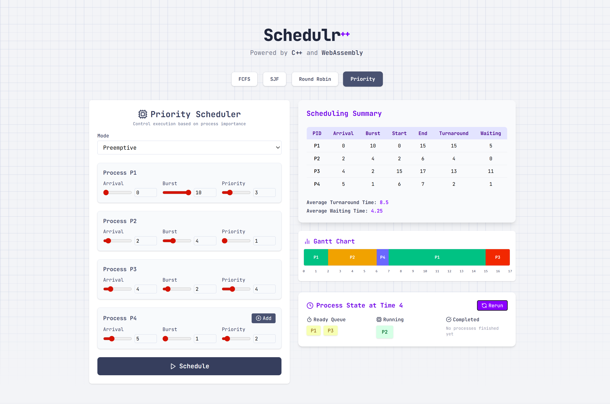
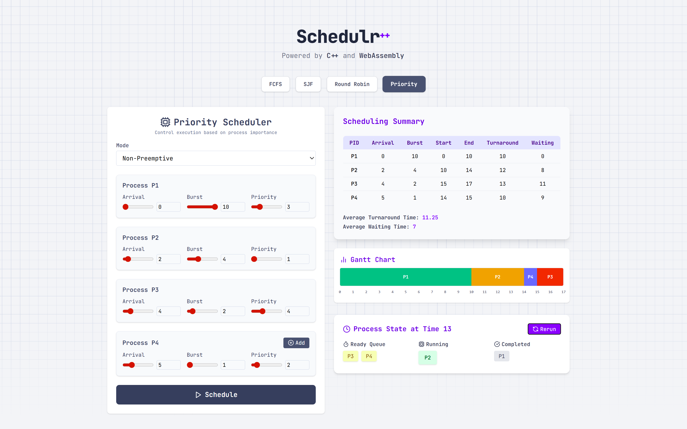

# ⚙️ Schedulr++

**Schedulr++** is a high-performance **visual CPU scheduling simulator** powered by **C++** (compiled to **WebAssembly**) and a sleek **React + Tailwind CSS** frontend.

> 🎯 Aimed at students, educators, and developers to explore and understand CPU scheduling algorithms through real-time, animated Gantt charts.

<br/>

## Supported Scheduling Algorithms

- 🕐 **FCFS** – First-Come, First-Served  
- 🔁 **Round Robin**
- ⏱️ **SJF** – Shortest Job First (Preemptive & Non-preemptive)  
- 🏅 **Priority Scheduling** (Preemptive & Non-preemptive)

<br/>

## 📸 Example Screenshots (Priority Scheduling)

### Preemptive Priority

> ⏳ In preemptive mode, the CPU immediately switches to a higher-priority process when it arrives.



---

### Non-Preemptive Priority

> 🚦 In non-preemptive mode, the CPU completes the current process even if a higher-priority one arrives.



<br/>

## Features

- ⚙️ Core algorithm logic implemented in **C++**
- 🌐 Runs entirely in-browser via **WebAssembly**
- 💫 Smooth animations with **Framer Motion**
- 🎨 Clean and responsive UI using **Tailwind CSS**
- 🧠 Interactive input form and real-time Gantt chart rendering
- 📈 Designed to clearly visualize scheduling flow and decisions

<br/>

## 🧪 Try It Out

You can test the simulator live in your browser:

👉 [**Launch Schedulr++ Live**](https://schedulrpp.netlify.app/)

> No installation needed — just input your processes and start simulating!

<br/>

## 📂 Project Structure

```bash
schedulr++
├── public/         # WebAssembly (.wasm) and JS bindings
├── src/            # React UI components, forms, and visualizations
├── dist/           # Production build output (after deployment)
